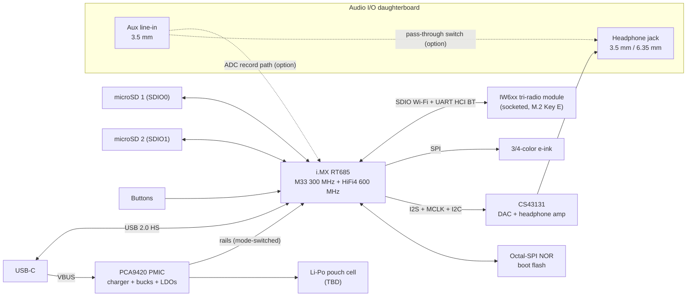

# OSAP v1 — Open Source Audio Player

**Design Document (skeleton — rev 0.1, 2026-07-16)**

> Status: outline / early architecture. Items marked **TBD** are undecided.
> Open questions are collected in [§9](#9-risks--open-questions).
> Less-common acronyms are expanded in [§12](#12-acronyms--terms).

---

## 1. Project Overview

- **Name:** OSAP (Open Source Audio Player), version 1
- **Vision:** A thin, long-battery-life, audiophile-grade portable music player whose
  hardware and firmware are fully open source.
- **Design priorities (in order):**
  1. Audio quality (high-end DAC + proper headphone amplification)
  2. Battery life
  3. Thinness
- **Out of scope for v1 (TBD/confirm):** Wi-Fi, streaming services, touchscreen, camera
- **Licenses (decided 2026-07-16 — 100% copyleft):**
  - Hardware: **CERN-OHL-S-2.0** (strongly reciprocal)
  - Firmware/software: **GPL-3.0-or-later**
  - Documentation: **CC-BY-SA-4.0** (ShareAlike)
  - Full texts in `LICENSES/`

## 2. Requirements

### 2.1 Functional

| # | Requirement |
|---|---|
| F1 | Local playback of lossless and lossy audio from removable storage |
| F2 | High-end Cirrus Logic DAC in the analog signal path |
| F3 | Built-in headphone amplifier |
| F4 | Modular headphone jack accommodating 1/8" (3.5 mm) and 1/4" (6.35 mm) connectors |
| F5 | Wireless audio output to Bluetooth headphones/speakers — Classic A2DP via socketed wireless module (LE Audio as a future addition) |
| F6 | 2× microSD card slots |
| F7 | USB-C: battery charging + USB 2.0 high-speed (480 Mbps) data for file transfer |
| F8 | 3- or 4-color e-ink display |
| F9 | Physical controls: navigation, power, media (play/pause/skip), volume |
| F10 | Battery powered, rechargeable |
| F11 | Analog auxiliary audio input (3.5 mm line-in) |
| F12 | All analog audio I/O connectors (headphone out, aux in) mounted on a removable daughterboard |

### 2.2 Non-functional targets (all TBD — set numeric goals before schematic capture)

- [ ] Battery life: ≥ **TBD** h screen-static local playback; ≥ **TBD** h BT streaming
- [x] Thickness: **10–20 mm** (drives battery and jack selection)
- [x] Footprint: approximately compact-cassette sized — target ≈ **100 × 64 mm**
      (cassette nominal: 100.4 × 63.8 × 12 mm)
- [ ] Audio: THD+N ≤ **TBD**, SNR/DR ≥ **TBD** dB, output power **TBD** mW into 16/32/300 Ω
- [ ] Output noise floor low enough for sensitive IEMs (≤ **TBD** µVrms)
- [ ] Supported sample rates: 44.1–**TBD** kHz, up to **TBD**-bit; DSD support TBD
- [ ] Cold boot to playback ≤ **TBD** s; resume from sleep ≤ **TBD** s

## 3. System Architecture

Two-chip design (adopted 2026-07-17): an **NXP i.MX RT685** audio-crossover MCU
(Cortex-M33 + HiFi4 DSP, two native SD host controllers, USB 2.0 high-speed with
on-chip PHY) paired with a socketed **NXP IW6xx tri-radio module** (Wi-Fi 6 +
dual-mode Bluetooth 5.4 + 802.15.4) for wireless audio — Bluetooth **Classic A2DP**
works with virtually every BT headphone. Firmware runs on upstream **Zephyr RTOS**
(Embassy/Rust was considered early and dropped). The device is fully functional with
the radio module unfitted. First hardware: **[EVT1.md](EVT1.md)**.



### 3.1 Compute allocation

| Core | Planned role |
|---|---|
| Cortex-M33 @ 300 MHz | Zephyr: UI, filesystem, USB, BT host (A2DP), playback engine; audio decode baseline |
| HiFi4 DSP @ 600 MHz | **Optional** offload: decode/SRC/EQ — proprietary Xtensa toolchain, optional build only (§7, R12) |
| IW6xx module CPUs | Wi-Fi / BT / 802.15.4 protocol processing on-module (NXP firmware) |

## 4. Hardware Design

### 4.1 SoC — NXP i.MX RT685 (MIMXRT685S)

- Cortex-M33 @ 300 MHz + HiFi4 DSP @ 600 MHz; **4.5 MB shared SRAM**; no internal
  flash — external octal-SPI NOR, XIP
- **2× SD/eMMC/SDIO host controllers** — one per microSD slot, native 4-bit
- USB 2.0 **high-speed** device/host with on-chip PHY
- Audio PLL with MCLK output pin — [ ] verify exact 22.5792/24.576 MHz attainability
  and jitter vs the CS43131 direct-MCLK mask (fallback: CS43131 PLL-reference mode, R7)
- [ ] VDDIO domain map (SD/e-ink expected native 3.3 V), power-mode map, errata (R6)
- [ ] Package selection; evaluate **i.MX RT700** successor before schematic freeze (R11)
- Mature part: in-tree Zephyr support (`mimxrt685_evk`), MCUXpresso SDK (BSD-3-Clause)

### 4.2 Audio subsystem

- **DAC — Cirrus Logic CS43131 (selected):** 32-bit/384 kHz DAC + integrated
  low-power ground-centered headphone amp. Verified constraints: **true MCLK
  required** (no SCLK-derived mode); **I2C-only** control; supplies VA/VCP/VL/VD at
  1.66–1.94 V plus **VP 3.0–5.25 V sequenced up-first/down-last**; HP_DETECT is
  VP-referenced. Design targets = the **32 Ω datasheet figures**: 125 dB(A) DR,
  −110 dB THD+N, 30.8 mW.
- **Headphone amplifier:** the CS43131's integrated stage is the baseline; fallback
  **CS43198 + discrete amp** (OPA1622-class) if measured drive into high-impedance
  1/4" cans falls short (R4).
- **Audio I/O daughterboard (F4, F11, F12) — decided:** all analog connectors
  (headphone output + 3.5 mm aux line-in) live on a removable daughterboard
  - [ ] Output jack format on the board: single 3.5 mm + threaded/snap 6.35 mm adapter
        vs dual jacks; swappable board variants later (e.g., 6.35 mm-only, balanced 4.4 mm)
  - [ ] Board-to-board interconnect: FPC vs mezzanine connector — pin-out carries
        headphone L/R + ground, aux L/R in + ground, jack-detect switches, shield
  - [ ] Grounding/shielding: keep analog runs short, away from RF and digital busses
- **Aux input (F11):** function to define at M0
  - [ ] Pass-through mode: analog switch routes aux → jack (line-level bypass, or via
        a small discrete buffer stage — the CS43131's amp has no external analog input)
  - [ ] Record/digitize mode: **discrete line-in ADC** (the CS43131 has none) —
        enables recording to SD and BT re-streaming
  - [ ] Or both — TBD (R10)
- **Clocking:** RT685 audio PLL → **MCLK output** for both 44.1/48 kHz families
  (verify §4.1); CS43131 PLL-reference mode as fallback.
- **Analog power:** dedicated low-noise LDO rails, ground/layout strategy, pop/click
  muting circuit. TBD.

### 4.3 Power

- Single-cell Li-Po pouch (thin form factor drives selection) — capacity **TBD** mAh
- PMIC — **NXP PCA9420 (decided 2026-07-17):** RT600-native pairing — in-tree Zephyr
  regulator driver, hardware **mode-select pins** switch rail groups with MCU sleep
  states; linear charger up to **315 mA** (R5), ship mode, ON-pin power button.
  Details: [EVT1.md §5.4](EVT1.md)
- USB-C power: 5 V; **discrete 5.1 kΩ CC pull-downs** (PCA9420 has no CC PHY), input
  current limit via I2C; USB-PD not planned
- Fuel gauging: battery-voltage divider → RT685 ADC + small **open-source** SoC
  estimator (no vendor binary anywhere in the image)
- [ ] Power budget table: decode+playback, BT streaming, e-ink refresh, sleep, off
- E-ink draws zero power when static — key enabler for the battery-life target

### 4.4 Storage — 2× microSD

- **Native 4-bit SD** on SDIO0/SDIO1 — one host controller per slot, 3.3 V signaling,
  no level shifters; ~10+ MB/s-class per slot expected (USB transfers become
  card-bound, not interface-bound) — benchmark at EVT-1 (E2/E3)
- [ ] UHS-I 1.8 V switching: evaluate (power/perf trade)
- [ ] Push-push vs hinged sockets; card detect; per-slot power switches (hot-swap + sleep)

### 4.5 USB-C

- Roles: charging sink + USB 2.0 HS device (no DRP/host planned — confirm)
- Device classes: MSC (expose cards directly) vs MTP (database-friendly) — TBD, see §5.9
- ESD/CC protection, connector mid-mount for thinness — TBD

### 4.6 Display — 3/4-color e-ink

- Panel candidates: **TBD** (survey Good Display / Waveshare SPI panels, ~2.9–4.2")
- [ ] Characterize refresh: full-color refresh is seconds-long; verify fast grayscale
      partial-refresh mode for browsing UI (color reserved for accents/album art)
- [ ] Size vs. thinness vs. resolution trade

### 4.7 Controls

- Buttons: power, 4-way/enter navigation, play/pause, next, prev, vol+, vol− (≈10)
- [ ] GPIO matrix vs direct; wake-from-off wiring via PMIC ON pin; software debounce
- [ ] Hold/lock switch? TBD

### 4.8 Wireless — socketed IW6xx module

- NXP **IW612-class** tri-radio module (Wi-Fi 6 + **dual-mode BT 5.4** + 802.15.4) on
  an **M.2 Key E** socket; host interfaces: SDIO 3.0 (Wi-Fi) + flow-controlled UART
  (BT HCI)
- Pre-certified module preserves modular RF certification; device works radio-less
- [ ] Module p/n selection (Murata/AzureWave IW61x) — pins the socket layout (R9)
- [ ] Antenna keep-out per module vendor; placement vs. enclosure material
- Wi-Fi *features* deferred past v1 (R13) — BT Classic A2DP is the v1 wireless feature

## 5. Firmware & Software Stack (Zephyr)

### 5.1 Platform & build system

- **RTOS:** upstream **Zephyr** (NXP HAL module `hal_nxp`) — version **TBD**, pin at M1
- **Build:** `west` workspace, single-image app build; optional separate HiFi4 DSP
  build (§5.2)
- **Configuration:** custom Zephyr **board definition** `osap_v1` (devicetree +
  Kconfig) — DAC on I2S + I2C, e-ink on SPI, `gpio-keys`, SDHC nodes per slot,
  PCA9420 regulators, IW6xx on SDIO + UART
- **Toolchain/CI:** Zephyr SDK container; GitHub Actions build + Twister on every PR

### 5.2 Runtime architecture — images & processors

| Image | Target | Contents |
|---|---|---|
| `app` | Cortex-M33 | Zephyr app: UI, playback engine, decoders, SBC encode, BT host, USB, FS |
| `dsp` (optional) | HiFi4 | Decode/SRC/EQ offload — optional build, proprietary Xtensa toolchain (§7, R12) |
| radio firmware | IW6xx module | NXP-provided binary, loaded at runtime over SDIO/UART — runs on separate hardware |

- **M33 ↔ DSP:** shared-SRAM mailbox/IPM ([ ] verify Zephyr RT600 DSP support and
  openamp/ipm story at M1 — only relevant if DSP build is used)
- **BT HCI:** Zephyr host on the M33 ↔ module controller over flow-controlled UART

### 5.3 Layered stack

| Layer | Components |
|---|---|
| Application | playback engine (SMF state machine), library manager, UI screens, settings/EQ |
| Middleware | LVGL (UI), FatFs, SBC codec, audio decoders (§5.5), music index |
| Zephyr subsystems | BT host incl. **Classic (A2DP/AVRCP — experimental)**, USB device (usbd), FS/disk, input, settings, PM, logging, shell |
| Vendor/HAL | MCUXpresso HAL (`hal_nxp`), PCA9420 regulator driver, IW6xx radio-firmware loader |
| Out-of-tree drivers | Cirrus DAC codec driver (Zephyr `audio_codec` API) — **to be written**, e-ink panel driver if not in tree (ssd16xx/uc81xx families are) |

### 5.4 Thread / task model (initial sketch — priorities TBD via profiling)

| Thread | Priority | Role |
|---|---|---|
| Audio datapath | High (cooperative) | Feed I2S DMA or SBC framing; hard real-time |
| Decoder | Medium | File → PCM into ring buffer (target **TBD** ms of buffered audio) |
| UI (LVGL) | Low | Screen updates, e-ink refresh scheduling |
| Library indexer | Lowest | Background scan/tag parse of both cards |
| BT host / USB / input | Zephyr-managed | Stack work queues |

### 5.5 Audio pipeline & codecs

- **Local path:** SD → decoder (M33, optionally HiFi4) → PCM ring buffer → I2S (DMA) → CS43131
- **BT path:** same ring buffer → sample-rate convert (44.1/48 k per sink) → **SBC encode** → A2DP over module HCI
- **Codecs (permissively-licensed C libs, candidates):** FLAC (`dr_flac`/libFLAC), WAV,
  MP3 (`minimp3`), Opus (libopus), Vorbis (`stb_vorbis`); AAC **TBD** (licensing);
  DSD **TBD** (depends on DAC path choice)
- [ ] Gapless playback, ReplayGain, EQ/DSP policy — TBD
- [ ] Bit-perfect path definition (volume in DAC vs host) — TBD
- [ ] Aux-in handling (if digitized per §4.2): capture path, record-to-SD and/or
      BT re-stream — pending the pass-through vs record decision

### 5.6 Storage & filesystem

- Zephyr disk-access + **FatFs**; two mount points (`/SD0`, `/SD1`) presented as one
  logical library
- FAT32 baseline; **exFAT TBD** (FatFs supports it behind a config flag, but it is
  patent-encumbered — licensing decision needed for >32 GB cards as shipped)
- Card hot-insert/removal handling and index invalidation — TBD

### 5.7 Music library / database

- On-device index of both cards: tags (ID3/Vorbis/FLAC comments), album/artist trees,
  playlists (M3U), resume positions
- Format: custom compact binary index vs embedded DB — **TBD** (SQLite likely too heavy;
  benchmark at M1)

### 5.8 Bluetooth — Classic A2DP (via IW6xx module)

- **Zephyr Classic host (experimental, NXP-driven)** over UART HCI: **A2DP source**
  role streaming to ordinary BT headphones — in-tree `a2dp_source` sample as the
  starting point (R1)
- **Codec:** SBC (A2DP mandatory); [ ] optional codecs (AAC/aptX) later — licensing review
- **Remote control:** AVRCP target — headphone buttons drive the playback engine
- **Volume:** AVRCP absolute volume — [ ] verify Zephyr support depth
- **LE Audio:** future addition once IW6xx LE Audio support matures — track, don't block v1
- Pairing/bonding UX on e-ink + buttons; bond storage via settings (§5.11); multi-device TBD
- [ ] BT/Wi-Fi coexistence is handled on-module; verify host-side arbitration needs

### 5.9 USB (device)

- Zephyr **usbd** (next-gen) stack over the RT685's high-speed UDC (on-chip PHY)
- **MSC vs MTP trade study:** MSC is in-tree and simple but requires unmounting the local
  FS while the host owns the cards; **MTP is not upstream** — custom class work if chosen
- Charge-only vs data enumeration behavior; USB audio (UAC2 "USB DAC" mode) as stretch — TBD

### 5.10 UI & input

- **LVGL** on the Zephyr display subsystem; monochrome/limited-palette theme
- E-ink strategy: fast grayscale **partial refresh** for navigation; full color refresh
  reserved for idle/album-art screens (ties to §4.6 panel characterization)
- Input: Zephyr `input` subsystem from `gpio-keys` (long-press, hold-to-power);
  wake wiring through the PMIC ON pin
- Screen map (browse / now-playing / settings / pairing) — TBD wireframes

### 5.11 Settings & persistence

- Zephyr **settings** subsystem on **NVS**, in a partition of the octal-SPI NOR:
  BT bonds, EQ presets, last-played position, UI preferences

### 5.12 Power management

- Zephyr PM: device runtime PM on all peripherals; CPU idle between buffer fills;
  radio module powered down when wireless unused; PCA9420 **mode-select rails**
  track RT600 sleep states
- Deep sleep with e-ink image retained (zero display draw); PCA9420 **ship mode**
  for power-off; wake on power button (ON pin) and VBUS
- [ ] Per-state current targets feed the §4.3 power budget table

### 5.13 DFU & updates

- **MCUboot** on the octal-SPI NOR (XIP + update slots) — the standard, boring RT600
  path
- Transport: **SMP over USB**; fallback: firmware file dropped on an SD card, applied
  at boot
- Recovery path and anti-rollback policy — TBD; radio-module firmware updates ride
  along as files loaded by the app

### 5.14 Observability & testing

- Logging via Zephyr `log` → RTT; `shell` enabled in dev builds only
- Unit tests: `ztest` + **Twister**; library/UI logic additionally run on `native_sim`
- HIL bench at M1+: MIMXRT685-EVK + IW612 module DVK + CS43131 eval; audio analyzer
  measurements at M4 (§10)

### 5.15 Firmware repository layout (planned)

```
firmware/
  west.yml            # Zephyr-pinned manifest (hal_nxp module)
  app/                # main Zephyr application (src/, Kconfig, prj.conf)
  boards/osap_v1/     # custom board definition (DTS, defconfig)
  drivers/            # out-of-tree: Cirrus DAC codec driver, etc.
  lib/                # decoders, music index, playback engine, battery gauge
  dsp/                # optional HiFi4 offload build (Xtensa toolchain)
  tests/              # ztest suites
```

## 6. Mechanical / Industrial Design

- **Dimensional targets:** ≈ **100 × 64 mm** footprint (compact-cassette sized,
  nominal 100.4 × 63.8 mm) × **10–20 mm** thick — aim for the low end of the
  thickness range; 20 mm is the hard ceiling
- [ ] Verify fit: 6.35 mm jack barrel, aux jack, microSD sockets, and e-ink module
      within the 10 mm best-case stack-up (jack body height is likely the floor-setter)
- [ ] Audio I/O daughterboard: mounting/retention, connector alignment with enclosure
      cutouts, swap/service access, interconnect strain relief
- [ ] Display size constraint: cassette footprint supports roughly a 2.9–3.5" panel
      after bezel/button allowance — feeds §4.6 panel selection
- [ ] Enclosure concept + materials (RF window needed if metal)
- [ ] Stack-up study: battery + PCB + e-ink + jack = thickness floor
- [ ] Button feel, membrane vs discrete tact switches

## 7. Compliance & Licensing

- [ ] FCC Part 15 / CE RED — pre-certified IW6xx module carries the modular radio
      grant; end-product testing still required (a radio-less SKU certifies as an
      unintentional radiator only)
- [ ] Bluetooth SIG qualification (QDID) — budget line item
- [ ] Battery transport (UN38.3), RoHS/REACH
- [ ] Codec/FS patent review: exFAT, AAC (MP3 patents expired)
- [ ] GPLv3 compatibility review: Apache-2.0 deps (Zephyr, hal_nxp) are one-way
      compatible; the IW6xx radio firmware is an NXP binary loaded onto the module's
      own CPUs — separate hardware, clean aggregation ([ ] confirm redistribution
      terms for shipping it in images/repos)
- [ ] HiFi4 DSP build uses the proprietary Cadence Xtensa toolchain — policy: DSP
      offload is **optional**, the shipped baseline is fully buildable with free
      toolchains; the DSP firmware source itself is GPL (R12)

## 8. Repository Layout

- `osap_v1/` — this document, firmware (planned), hardware (planned)
- `../osaplib/osapv1lib.kicad_sym` — shared KiCad symbol library
  - Note: contains STM32 symbols from an early architecture study (unused);
    **RT685, PCA9420, CS43131, and M.2 socket symbols need to be drawn**

## 9. Risks & Open Questions

| # | Risk / question | Impact | Next step |
|---|---|---|---|
| R1 | Zephyr Bluetooth **Classic host / A2DP source is experimental** — qualification depth unknown | v1 wireless feature | Prototype on RT685-EVK + IW612 DVK **before** EVT-1 layout; fallback: NXP EtherMind stack (license review) |
| R2 | Color e-ink refresh latency hurts browsing UX | Usability | Panel eval; grayscale partial refresh |
| R3 | Thin pouch cell sourcing at needed capacity | Battery life vs thickness | Cell vendor survey |
| R4 | CS43131 integrated amp drive into high-impedance 1/4" cans | Audio target | Measure at EVT-1 (E8); fallback CS43198 + discrete amp |
| R5 | PCA9420 charger caps at **315 mA** (~6–8 h for 1500–2000 mAh) | Charge UX | Accept, or evaluate PCA9421 / parallel charge path |
| R6 | RT685 VDDIO domains / power-mode map unverified vs rail plan | Schematic rework | RM review before capture (EVT1 V2) |
| R7 | Audio-PLL exact-rate/jitter for CS43131 direct MCLK unverified | Clocking | Verify RM; CS43131 PLL-ref fallback (EVT1 V4) |
| R8 | USB MTP class not upstream in Zephyr — custom work if chosen over MSC | FW effort | §5.9 trade study at M1 |
| R9 | M.2 Key E pinout vs specific module straps may diverge | Radio socket | Pin against a specific Murata p/n early (EVT1 V6) |
| R10 | Aux-input function undefined (pass-through vs record) — record needs a discrete ADC | Architecture | Decide at M0 (§4.2) |
| R11 | i.MX RT700 supersedes RT600 mid-project | Longevity | Availability/longevity check on both before schematic freeze |
| R12 | HiFi4 Xtensa toolchain is proprietary | Open-source ethos | DSP strictly optional; M33 baseline full-featured (§7) |
| R13 | Wi-Fi capability invites scope creep (streaming, sync) | Focus | Deferred past v1; revisit at DVT with product hat on |

## 10. Roadmap (draft)

- **M0** — Requirements finalized (fill every TBD in §2.2; aux decision R10)
- **M1** — Dev-kit prototyping: MIMXRT685-EVK + IW612 module DVK + CS43131 eval
  board; local playback + **A2DP source proof** (retires R1)
- **M2** — E-ink UI, dual-SD, and USB MSC/MTP working on the EVK bench
- **M3** — **EVT-1**: first custom PCB, full feature set — see **[EVT1.md](EVT1.md)**
  (schematic in KiCad, `osaplib` symbols)
- **M4** — DVT: enclosure + battery integration, power/audio measurements vs targets
- **M5** — Compliance testing, v1.0 release of hardware + firmware

## 11. References

- NXP i.MX RT600 / MIMXRT685-EVK: <https://www.nxp.com/design/design-center/development-boards-and-designs/i-mx-evaluation-and-development-boards/i-mx-rt600-evaluation-kit:MIMXRT685-EVK>
- NXP IW612 tri-radio: <https://www.nxp.com/products/IW612> (datasheet: <https://www.nxp.com/docs/en/data-sheet/IW612.pdf>)
- NXP PCA9420 PMIC: <https://www.nxp.com/products/PCA9420-PCA9421>
- Cirrus Logic CS43131 datasheet (DS1155F2): <https://statics.cirrus.com/pubs/proDatasheet/CS43131_DS1155F2.pdf>
- Zephyr RTOS: <https://zephyrproject.org> — `mimxrt685_evk` board docs; Classic A2DP
  source sample: <https://docs.zephyrproject.org/latest/samples/bluetooth/classic/a2dp_source/README.html>
- LVGL: <https://lvgl.io>
- E-ink panel datasheets — TBD
- EVT-1 board document: [EVT1.md](EVT1.md)

## 12. Acronyms & Terms

### Audio & signal path

| Term | Meaning |
|---|---|
| THD+N | Total Harmonic Distortion plus Noise — the primary analog-quality figure of merit for the DAC/amp path |
| SNR / DR | Signal-to-Noise Ratio / Dynamic Range (dB) |
| PCM | Pulse-Code Modulation — plain uncompressed digital audio samples; what decoders output and the DAC consumes |
| TDM | Time-Division Multiplexing — multichannel serial audio bus; superset of I2S framing |
| DSD | Direct Stream Digital — 1-bit, very-high-rate audio format (SACD heritage); some Cirrus DACs accept it natively |
| PLL | Phase-Locked Loop — clock synthesizer; lets one crystal serve both 44.1 kHz and 48 kHz sample-rate families |
| IEM | In-Ear Monitor — high-sensitivity earphones; the demanding case for amplifier noise floor |
| ID3 | Metadata tag format embedded in MP3 files (title/artist/album) |

### Bluetooth LE Audio

| Term | Meaning |
|---|---|
| A2DP | Advanced Audio Distribution Profile — Bluetooth Classic audio streaming; we are the *source* role |
| AVRCP | Audio/Video Remote Control Profile — headphone buttons (play/pause/skip) control our playback engine |
| SBC | Subband Codec — A2DP's mandatory codec; encoded in firmware before streaming |
| BR/EDR | Basic Rate / Enhanced Data Rate — "Bluetooth Classic", the mode A2DP runs on (vs LE) |
| LE Audio / LC3 | The modern BLE-based audio system and its codec — a future addition once IW6xx support matures (§5.8) |
| HCI | Host Controller Interface — the standard protocol between the Zephyr BT host (RT685) and the controller (IW6xx module, over UART) |
| SIG | (Bluetooth) Special Interest Group — the standards body; products must be qualified with it |
| QDID | Qualified Design ID — the Bluetooth SIG listing number a qualified product receives |

### USB & power

| Term | Meaning |
|---|---|
| MSC | Mass Storage Class — USB device class exposing the SD cards as raw drives |
| MTP | Media Transfer Protocol — file-level USB transfer class (as used by cameras/phones); FS stays owned by the device |
| UAC2 | USB Audio Class 2 — would let the player double as a USB DAC for a computer (stretch goal) |
| UDC | USB Device Controller — the SoC-side USB hardware a device stack drives |
| VBUS | The 5 V supply pin of a USB connection; also our USB-insertion wake signal |
| CC | Configuration Channel — USB-C pins used to detect cable orientation and advertised supply current |
| BC1.2 | USB Battery Charging 1.2 — legacy spec for detecting charger current capability |
| PD | (USB) Power Delivery — higher-power USB-C negotiation; likely unnecessary here |
| DRP | Dual-Role Port — USB-C port that can be host or device; not planned |
| PMIC | Power Management IC — combined charger/regulator chip (PCA9420) |
| LDO | Low-DropOut regulator — linear regulator; used for quiet analog supply rails |
| ESD | ElectroStatic Discharge — protection required on user-touchable connectors |

### Zephyr / platform

| Term | Meaning |
|---|---|
| HiFi4 | Cadence Tensilica audio DSP core inside the RT685 — optional decode/EQ offload |
| XIP | eXecute In Place — running code directly from the octal-SPI NOR boot flash |
| SDIO / SDMMC | Native 4-bit SD card bus interfaces — the RT685 has two host controllers, one per card slot |
| NVS | Non-Volatile Storage — Zephyr settings backend on a NOR-flash partition |
| NVM | Non-Volatile Memory — generic term for persistent storage |
| IPC | Inter-Processor Communication — M33 ↔ HiFi4 mailbox/shared-SRAM messaging (DSP build only) |
| DTS | DeviceTree Source — Zephyr's declarative hardware description format |
| SMF | State Machine Framework — Zephyr library; basis of the playback engine |
| DFU | Device Firmware Update — MCUboot + SMP-over-USB here |
| DMA | Direct Memory Access — peripheral data transfer without CPU involvement; keeps the audio path low-power |
| RTT | Real-Time Transfer — SEGGER debug-probe channel used for log output |
| DK / EVK | Development / Evaluation Kit (e.g., MIMXRT685-EVK) |
| HIL | Hardware-In-the-Loop — automated tests run against real hardware |
| M.2 Key E | Socket/card standard used by Wi-Fi/BT modules — the IW6xx radio socket format |

### Project, compliance & licensing

| Term | Meaning |
|---|---|
| EVT / DVT | Engineering / Design Validation Test — successive prototype build phases (§10 M3/M4) |
| BOM | Bill Of Materials |
| RED | Radio Equipment Directive — EU (CE) regulation covering intentional radio transmitters |
| RoHS / REACH | EU regulations restricting hazardous substances / chemicals in products |
| UN38.3 | UN transport-safety test standard required to ship lithium batteries |
| CERN-OHL-S | CERN Open Hardware Licence, Strongly-reciprocal variant — the project's hardware license (copyleft) |
| GPL-3.0-or-later | GNU General Public License v3 (or later) — the project's firmware license (strong copyleft) |
| CC-BY-SA | Creative Commons Attribution-ShareAlike — the project's documentation license (copyleft via ShareAlike) |
