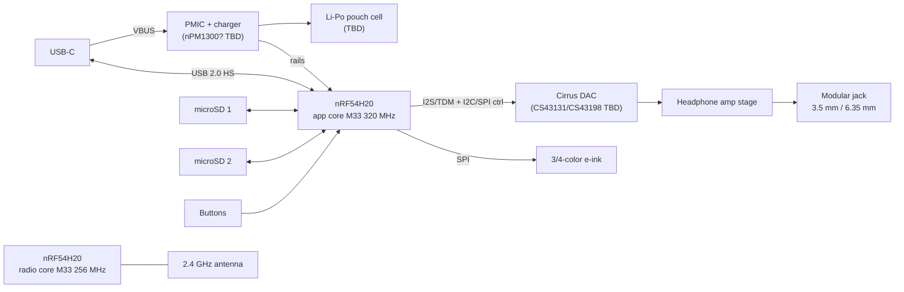

# OSAP v1 — Open Source Audio Player

**Design Document (skeleton — rev 0.1, 2026-07-16)**

> Status: outline / early architecture. Items marked **TBD** are undecided.
> Open questions are collected in [§9](#9-risks--open-questions).
> Less-common acronyms are expanded in [§12](#12-acronyms--terms).

---

## 1. Project Overview

- **Name:** OSAP (Open Source Audio Player), version 1
- **Vision:** A thin, long-battery-life, audiophile-grade portable music player whose
  hardware and firmware are fully open source.
- **Design priorities (in order):**
  1. Audio quality (high-end DAC + proper headphone amplification)
  2. Battery life
  3. Thinness
- **Out of scope for v1 (TBD/confirm):** Wi-Fi, streaming services, touchscreen, camera
- **Licenses (decided 2026-07-16 — 100% copyleft):**
  - Hardware: **CERN-OHL-S-2.0** (strongly reciprocal)
  - Firmware/software: **GPL-3.0-or-later**
  - Documentation: **CC-BY-SA-4.0** (ShareAlike)
  - Full texts in `LICENSES/`

## 2. Requirements

### 2.1 Functional

| # | Requirement |
|---|---|
| F1 | Local playback of lossless and lossy audio from removable storage |
| F2 | High-end Cirrus Logic DAC in the analog signal path |
| F3 | Built-in headphone amplifier |
| F4 | Modular headphone jack accommodating 1/8" (3.5 mm) and 1/4" (6.35 mm) connectors |
| F5 | Wireless audio output to Bluetooth headphones/speakers (LE Audio) |
| F6 | 2× microSD card slots |
| F7 | USB-C: battery charging + USB 2.0 high-speed (480 Mbps) data for file transfer |
| F8 | 3- or 4-color e-ink display |
| F9 | Physical controls: navigation, power, media (play/pause/skip), volume |
| F10 | Battery powered, rechargeable |

### 2.2 Non-functional targets (all TBD — set numeric goals before schematic capture)

- [ ] Battery life: ≥ **TBD** h screen-static local playback; ≥ **TBD** h BT streaming
- [x] Thickness: **10–20 mm** (drives battery and jack selection)
- [x] Footprint: approximately compact-cassette sized — target ≈ **100 × 64 mm**
      (cassette nominal: 100.4 × 63.8 × 12 mm)
- [ ] Audio: THD+N ≤ **TBD**, SNR/DR ≥ **TBD** dB, output power **TBD** mW into 16/32/300 Ω
- [ ] Output noise floor low enough for sensitive IEMs (≤ **TBD** µVrms)
- [ ] Supported sample rates: 44.1–**TBD** kHz, up to **TBD**-bit; DSD support TBD
- [ ] Cold boot to playback ≤ **TBD** s; resume from sleep ≤ **TBD** s

## 3. System Architecture

Single-SoC design around the **Nordic nRF54H20** — chosen because it is the only current
MCU-class part with both an integrated Bluetooth radio (LE Audio capable) and USB 2.0
high-speed. Firmware runs on **Zephyr RTOS / nRF Connect SDK** (Embassy/Rust was
considered and dropped: Nordic's LE Audio/LC3 stack lives in NCS).



### 3.1 Core allocation (verify against NCS partitioning)

| Core | Planned role |
|---|---|
| Application core (Cortex-M33, 320 MHz) | UI, filesystem, audio decode, LC3 encode (verify), USB stack, playback engine |
| Radio core (Cortex-M33, 256 MHz) | BLE controller / LE Audio link layer |
| PPR (RISC-V coprocessor) | Low-power peripheral tasks: button scan, wake logic (candidate) |
| FLPR (RISC-V coprocessor) | Fast soft-peripherals — possible SD/display assist (candidate) |

## 4. Hardware Design

### 4.1 SoC — Nordic nRF54H20

- 2 MB NVM / 1 MB RAM, USB 2.0 HS device, BLE 5.4 (LE Audio), 14-bit ADC
- [ ] Verify I2S/TDM peripheral capabilities: master clock generation, supported rates,
      audio-grade clocking (audio PLL?)
- [ ] **Verify SD card interfacing** — does the H20 expose an SDMMC/SDIO host, or is SD
      limited to SPI mode? (Throughput of two cards + USB HS offload hinges on this.)
- [ ] Package/variant selection, availability, and errata review
- [ ] Chip-down vs. pre-certified module decision (affects RF cert cost, §7)

### 4.2 Audio subsystem

- **DAC (Cirrus Logic, high-end):**
  - Candidate A: **CS43131** — DAC + integrated low-power ground-centered headphone amp
  - Candidate B: **CS43198** — same DAC core, line-level out, paired with discrete amp
  - [ ] Decision matrix: power draw vs. drive capability vs. BOM complexity
- **Headphone amplifier:** integrated (CS43131) or discrete stage (candidates: OPA1622,
  INA1620, TPA6120A2 — power-hungry). Must drive both IEMs and 1/4" high-impedance cans.
- **Modular jack (F4):** options to evaluate —
  - [ ] Single 3.5 mm + threaded/snap 6.35 mm adapter (thinnest)
  - [ ] Swappable jack daughterboard (true modularity, mechanical cost)
  - [ ] Balanced output (4.4 mm) in scope? TBD
- **Clocking:** 44.1 kHz vs 48 kHz families — single crystal + DAC PLL, dual crystals, or
  fractional PLL. TBD after DAC selection.
- **Analog power:** dedicated low-noise LDO rails, ground/layout strategy, pop/click
  muting circuit. TBD.

### 4.3 Power

- Single-cell Li-Po pouch (thin form factor drives selection) — capacity **TBD** mAh
- PMIC/charger candidate: **nPM1300** (USB-C CC detection, 800 mA charger, fuel gauging,
  pairs with Nordic SoCs) — [ ] confirm rail budget fits, else discrete charger + gauge
- USB-C power: 5 V default + BC1.2/CC detection; USB-PD **TBD** (likely unnecessary)
- [ ] Power budget table: decode+playback, BT streaming, e-ink refresh, sleep, off
- E-ink draws zero power when static — key enabler for the battery-life target

### 4.4 Storage — 2× microSD

- [ ] Interface per slot (SDMMC 4-bit vs SPI — depends on §4.1 finding)
- [ ] Push-push vs hinged sockets; card detect; hot-swap policy
- [ ] Throughput target for USB file transfer (bottleneck analysis: SD ↔ SoC ↔ USB HS)

### 4.5 USB-C

- Roles: charging sink + USB 2.0 HS device (no DRP/host planned — confirm)
- Device classes: MSC (expose cards directly) vs MTP (database-friendly) — TBD, see §5.9
- ESD/CC protection, connector mid-mount for thinness — TBD

### 4.6 Display — 3/4-color e-ink

- Panel candidates: **TBD** (survey Good Display / Waveshare SPI panels, ~2.9–4.2")
- [ ] Characterize refresh: full-color refresh is seconds-long; verify fast grayscale
      partial-refresh mode for browsing UI (color reserved for accents/album art)
- [ ] Size vs. thinness vs. resolution trade

### 4.7 Controls

- Buttons: power, 4-way/enter navigation, play/pause, next, prev, vol+, vol− (≈10)
- [ ] GPIO matrix vs direct; wake-from-off wiring; debounce in PPR core (candidate)
- [ ] Hold/lock switch? TBD

### 4.8 RF

- [ ] Antenna type (PCB trace/chip), matching network, placement vs. metal enclosure
- [ ] See §7 for qualification path

## 5. Firmware & Software Stack (Zephyr)

### 5.1 Platform & build system

- **RTOS:** Zephyr, consumed via **nRF Connect SDK (NCS)** — version **TBD**, pin at M1
- **Build:** `west` workspace + **sysbuild** (multi-image build: app core, radio core,
  and optional PPR/FLPR images in one invocation)
- **Configuration:** custom Zephyr **board definition** `osap_v1` (devicetree + Kconfig);
  hardware described in DTS — DAC on I2S/TDM + I2C, e-ink on SPI, `gpio-keys` for buttons,
  SD slots, nPM1300 regulators
- **Toolchain/CI:** NCS toolchain container; GitHub Actions build + Twister on every PR

### 5.2 Runtime architecture — images & cores

| Image | Core | Contents |
|---|---|---|
| `app` | App core (M33, 320 MHz) | Zephyr app: UI, playback engine, decoders, LC3 encode, BT host, USB, FS |
| `radio` | Radio core (M33, 256 MHz) | BT LE controller (Nordic SoftDevice Controller build for H20) |
| `ppr` (optional) | RISC-V PPR | Low-power input scanning / wake logic — evaluate at M1 |
| `flpr` (optional) | RISC-V FLPR | Soft-peripheral assist (SD/display) — evaluate if needed |

- **Inter-core IPC:** Zephyr `ipc_service` (ICMsg/ICBMsg) — HCI transported app ↔ radio
- **Secure domain:** H20's secure domain core owns boot + SUIT update processing (Nordic-provided)

### 5.3 Layered stack

| Layer | Components |
|---|---|
| Application | playback engine (SMF state machine), library manager, UI screens, settings/EQ |
| Middleware | LVGL (UI), FatFs, liblc3, audio decoders (§5.5), music index |
| Zephyr subsystems | BT host + LE Audio (BAP/CAP), USB device (usbd), FS/disk, input, settings, PM, logging, shell |
| Vendor/HAL | nrfx drivers, SoftDevice Controller, nPM1300 driver, SUIT |
| Out-of-tree drivers | Cirrus DAC codec driver (Zephyr `audio_codec` API) — **to be written**, e-ink panel driver if not in tree (ssd16xx/uc81xx families are) |

### 5.4 Thread / task model (initial sketch — priorities TBD via profiling)

| Thread | Priority | Role |
|---|---|---|
| Audio datapath | High (cooperative) | Feed I2S/TDM DMA or LC3 framing; hard real-time |
| Decoder | Medium | File → PCM into ring buffer (target **TBD** ms of buffered audio) |
| UI (LVGL) | Low | Screen updates, e-ink refresh scheduling |
| Library indexer | Lowest | Background scan/tag parse of both cards |
| BT host / USB / input | Zephyr-managed | Stack work queues |

### 5.5 Audio pipeline & codecs

- **Local path:** SD → decoder → PCM ring buffer → I2S/TDM (DMA) → Cirrus DAC
- **BT path:** same ring buffer → sample-rate convert to 48 kHz (TBD) → **LC3 encode** → BAP unicast
- **Codecs (permissively-licensed C libs, candidates):** FLAC (`dr_flac`/libFLAC), WAV,
  MP3 (`minimp3`), Opus (libopus), Vorbis (`stb_vorbis`); AAC **TBD** (licensing);
  DSD **TBD** (depends on DAC path choice)
- [ ] Gapless playback, ReplayGain, EQ/DSP policy — TBD
- [ ] Bit-perfect path definition (volume in DAC vs host) — TBD

### 5.6 Storage & filesystem

- Zephyr disk-access + **FatFs**; two mount points (`/SD0`, `/SD1`) presented as one
  logical library
- FAT32 baseline; **exFAT TBD** (FatFs supports it behind a config flag, but it is
  patent-encumbered — licensing decision needed for >32 GB cards as shipped)
- Card hot-insert/removal handling and index invalidation — TBD

### 5.7 Music library / database

- On-device index of both cards: tags (ID3/Vorbis/FLAC comments), album/artist trees,
  playlists (M3U), resume positions
- Format: custom compact binary index vs embedded DB — **TBD** (SQLite likely too heavy;
  benchmark at M1)

### 5.8 Bluetooth — LE Audio

- **Roles:** CAP Initiator / **BAP Unicast Client (source)** streaming to earbuds/headphones
- **Codec:** LC3 via `liblc3` (in-tree); QoS presets (e.g., 48_4_1) — selection TBD
- **Volume:** VCP Volume Controller (adjust remote volume from device)
- **Remote control:** MCP Media Control Server (headphone buttons drive playback) — stretch
- **Broadcast (Auracast) source:** stretch goal, TBD
- Pairing/bonding UX on e-ink + buttons; bond storage via settings (§5.11); multi-device TBD

### 5.9 USB (device)

- Zephyr **usbd** (next-gen) stack over the H20's high-speed UDC
- **MSC vs MTP trade study:** MSC is in-tree and simple but requires unmounting the local
  FS while the host owns the cards; **MTP is not upstream** — custom class work if chosen
- Charge-only vs data enumeration behavior; USB audio (UAC2 "USB DAC" mode) as stretch — TBD

### 5.10 UI & input

- **LVGL** on the Zephyr display subsystem; monochrome/limited-palette theme
- E-ink strategy: fast grayscale **partial refresh** for navigation; full color refresh
  reserved for idle/album-art screens (ties to §4.6 panel characterization)
- Input: Zephyr `input` subsystem from `gpio-keys` (long-press, hold-to-power);
  optional PPR offload for always-on scanning
- Screen map (browse / now-playing / settings / pairing) — TBD wireframes

### 5.11 Settings & persistence

- Zephyr **settings** subsystem on **ZMS** backend (suited to the H20's MRAM):
  BT bonds, EQ presets, last-played position, UI preferences

### 5.12 Power management

- Zephyr PM: device runtime PM on all peripherals; CPU idle between buffer fills;
  radio core suspended when BT unused
- Deep sleep with e-ink image retained (zero display draw); System OFF + nPM1300
  **ship mode** for power-off; wake on power button and VBUS
- [ ] Per-state current targets feed the §4.3 power budget table

### 5.13 DFU & updates

- **SUIT**-based DFU (the nRF54H20 scheme — MCUboot is not supported on H20):
  signed manifests covering app + radio images, processed by the secure domain
- Transport: USB (mechanism **TBD** — verify current NCS options for SUIT over USB;
  fallback: firmware file dropped on SD card, applied at boot)
- Recovery path and anti-rollback policy — TBD

### 5.14 Observability & testing

- Logging via Zephyr `log` → RTT; `shell` enabled in dev builds only
- Unit tests: `ztest` + **Twister**; library/UI logic additionally run on `native_sim`
- HIL bench at M1+: nRF54H20 DK + DAC eval; audio analyzer measurements at M4 (§10)

### 5.15 Firmware repository layout (planned)

```
firmware/
  west.yml            # NCS-pinned manifest
  app/                # main Zephyr application (src/, Kconfig, prj.conf)
  boards/osap_v1/     # custom board definition (DTS, defconfig)
  drivers/            # out-of-tree: Cirrus DAC codec driver, etc.
  lib/                # decoders, music index, playback engine (unit-testable)
  sysbuild/           # multi-image configuration
  tests/              # ztest suites
```

## 6. Mechanical / Industrial Design

- **Dimensional targets:** ≈ **100 × 64 mm** footprint (compact-cassette sized,
  nominal 100.4 × 63.8 mm) × **10–20 mm** thick — aim for the low end of the
  thickness range; 20 mm is the hard ceiling
- [ ] Verify fit: 6.35 mm jack barrel, microSD sockets, and e-ink module within the
      10 mm best-case stack-up (jack body height is likely the floor-setter)
- [ ] Display size constraint: cassette footprint supports roughly a 2.9–3.5" panel
      after bezel/button allowance — feeds §4.6 panel selection
- [ ] Enclosure concept + materials (RF window needed if metal)
- [ ] Stack-up study: battery + PCB + e-ink + jack = thickness floor
- [ ] Jack module mechanical retention (per §4.2 decision)
- [ ] Button feel, membrane vs discrete tact switches

## 7. Compliance & Licensing

- [ ] FCC Part 15 / CE RED (intentional radiator) — module vs chip-down decision (§4.1)
- [ ] Bluetooth SIG qualification (QDID) — budget line item
- [ ] Battery transport (UN38.3), RoHS/REACH
- [ ] Codec/FS patent review: exFAT, AAC (MP3 patents expired)
- [ ] GPLv3 compatibility review: Apache-2.0 deps (Zephyr, liblc3) are one-way
      compatible; Nordic's proprietary SoftDevice Controller blob on the radio core
      needs review (mitigant: it's a separate image talking HCI over IPC, arguably a
      separate program)

## 8. Repository Layout

- `osap_v1/` — this document, firmware (planned), hardware (planned)
- `../osaplib/osapv1lib.kicad_sym` — shared KiCad symbol library
  - Note: currently contains STM32N655/STM32WBA65 symbols from an earlier architecture
    study; **nRF54H20 symbol needs to be drawn**

## 9. Risks & Open Questions

| # | Risk / question | Impact | Next step |
|---|---|---|---|
| R1 | nRF54H20 SD interface may be SPI-only | Slow library scans + USB transfers | Read datasheet; prototype throughput |
| R2 | LE Audio only — no Classic A2DP; older BT headphones won't connect | Compatibility | Accept & document, or revisit BT companion chip |
| R3 | Color e-ink refresh latency hurts browsing UX | Usability | Panel eval; grayscale partial refresh |
| R4 | nRF54H20 silicon maturity / availability | Schedule | Check distributor stock + errata |
| R5 | Thin pouch cell sourcing at needed capacity | Battery life vs thickness | Cell vendor survey |
| R6 | Amp choice vs battery life (TPA6120A2-class draw) | Battery target | Power budget before DAC/amp decision |
| R7 | LC3 encode CPU load alongside decode + UI on app core | Performance | Profile on nRF54H20 DK |
| R8 | USB MTP class not upstream in Zephyr — custom work if chosen over MSC | FW effort | §5.9 trade study at M1 |
| R9 | SUIT-over-USB DFU transport maturity in NCS unverified | Update path | Verify NCS docs; SD-card fallback |

## 10. Roadmap (draft)

- **M0** — Requirements finalized (fill every TBD in §2.2)
- **M1** — Dev-kit bring-up: nRF54H20 DK + Cirrus DAC eval board + e-ink module;
  local playback proof of concept
- **M2** — LE Audio streaming to headphones from DK
- **M3** — EVT board: first custom PCB (schematic in KiCad, `osaplib` symbols)
- **M4** — DVT: enclosure + battery integration, power/audio measurements vs targets
- **M5** — Compliance testing, v1.0 release of hardware + firmware

## 11. References

- Nordic nRF54H20: <https://www.nordicsemi.com/Products/nRF54H20>
- nRF5340 Audio DK / LE Audio application (NCS) — LE Audio reference
- Cirrus Logic CS43131 / CS43198 datasheets — TBD links
- Zephyr RTOS: <https://zephyrproject.org>
- nRF Connect SDK docs (LE Audio, SUIT DFU, sysbuild): <https://docs.nordicsemi.com/bundle/ncs-latest/page/nrf/index.html>
- Zephyr LE Audio (BAP/CAP) subsystem docs — TBD pin to release
- LVGL: <https://lvgl.io>; liblc3: <https://github.com/google/liblc3>

## 12. Acronyms & Terms

### Audio & signal path

| Term | Meaning |
|---|---|
| THD+N | Total Harmonic Distortion plus Noise — the primary analog-quality figure of merit for the DAC/amp path |
| SNR / DR | Signal-to-Noise Ratio / Dynamic Range (dB) |
| PCM | Pulse-Code Modulation — plain uncompressed digital audio samples; what decoders output and the DAC consumes |
| TDM | Time-Division Multiplexing — multichannel serial audio bus; superset of I2S framing |
| DSD | Direct Stream Digital — 1-bit, very-high-rate audio format (SACD heritage); some Cirrus DACs accept it natively |
| PLL | Phase-Locked Loop — clock synthesizer; lets one crystal serve both 44.1 kHz and 48 kHz sample-rate families |
| IEM | In-Ear Monitor — high-sensitivity earphones; the demanding case for amplifier noise floor |
| ID3 | Metadata tag format embedded in MP3 files (title/artist/album) |

### Bluetooth LE Audio

| Term | Meaning |
|---|---|
| LC3 | Low Complexity Communication Codec — the mandatory LE Audio codec; we encode to it in firmware (liblc3) |
| BAP | Basic Audio Profile — defines how LE Audio streams are configured and started; "unicast client/source" is our role |
| CAP | Common Audio Profile — coordination layer above BAP/VCP/MCP for multi-device audio; "initiator" is our role |
| VCP | Volume Control Profile — lets this device adjust the headphone's rendered volume |
| MCP / MCS | Media Control Profile / Service — lets headphone buttons (play/pause/skip) control our playback engine |
| HCI | Host Controller Interface — the standard protocol between the BT host (app core) and controller (radio core) |
| SIG | (Bluetooth) Special Interest Group — the standards body; products must be qualified with it |
| QDID | Qualified Design ID — the Bluetooth SIG listing number a qualified product receives |

### USB & power

| Term | Meaning |
|---|---|
| MSC | Mass Storage Class — USB device class exposing the SD cards as raw drives |
| MTP | Media Transfer Protocol — file-level USB transfer class (as used by cameras/phones); FS stays owned by the device |
| UAC2 | USB Audio Class 2 — would let the player double as a USB DAC for a computer (stretch goal) |
| UDC | USB Device Controller — the SoC-side USB hardware a device stack drives |
| VBUS | The 5 V supply pin of a USB connection; also our USB-insertion wake signal |
| CC | Configuration Channel — USB-C pins used to detect cable orientation and advertised supply current |
| BC1.2 | USB Battery Charging 1.2 — legacy spec for detecting charger current capability |
| PD | (USB) Power Delivery — higher-power USB-C negotiation; likely unnecessary here |
| DRP | Dual-Role Port — USB-C port that can be host or device; not planned |
| PMIC | Power Management IC — combined charger/regulator chip (candidate: nPM1300) |
| LDO | Low-DropOut regulator — linear regulator; used for quiet analog supply rails |
| ESD | ElectroStatic Discharge — protection required on user-touchable connectors |

### Zephyr / Nordic platform

| Term | Meaning |
|---|---|
| NCS | nRF Connect SDK — Nordic's Zephyr-based SDK distribution |
| PPR | Peripheral Processor — the nRF54H20's low-power RISC-V coprocessor (always-on tasks) |
| FLPR | Fast Lightweight Processor — the nRF54H20's fast RISC-V coprocessor (software-defined peripherals) |
| IPC | Inter-Processor Communication — messaging between the H20's cores |
| ICMsg / ICBMsg | Inter-Core (Buffered) Messaging — Zephyr `ipc_service` backends used for that messaging |
| DTS | DeviceTree Source — Zephyr's declarative hardware description format |
| SMF | State Machine Framework — Zephyr library; basis of the playback engine |
| ZMS | Zephyr Memory Storage — settings storage backend designed for MRAM/RRAM-style memories |
| MRAM | Magnetoresistive RAM — the nRF54H20's non-volatile memory technology |
| NVM | Non-Volatile Memory — generic term for on-chip persistent storage |
| SDMMC / SDIO | Native 4-bit SD card bus interfaces (vs. slow SPI fallback mode) — availability on the H20 is open question R1 |
| DFU | Device Firmware Update |
| SUIT | Software Updates for Internet of Things — IETF update standard; the H20's DFU mechanism |
| DMA | Direct Memory Access — peripheral data transfer without CPU involvement; keeps the audio path low-power |
| RTT | Real-Time Transfer — SEGGER debug-probe channel used for log output |
| DK | Development Kit (e.g., nRF54H20 DK) |
| HIL | Hardware-In-the-Loop — automated tests run against real hardware |

### Project, compliance & licensing

| Term | Meaning |
|---|---|
| EVT / DVT | Engineering / Design Validation Test — successive prototype build phases (§10 M3/M4) |
| BOM | Bill Of Materials |
| RED | Radio Equipment Directive — EU (CE) regulation covering intentional radio transmitters |
| RoHS / REACH | EU regulations restricting hazardous substances / chemicals in products |
| UN38.3 | UN transport-safety test standard required to ship lithium batteries |
| CERN-OHL-S | CERN Open Hardware Licence, Strongly-reciprocal variant — the project's hardware license (copyleft) |
| GPL-3.0-or-later | GNU General Public License v3 (or later) — the project's firmware license (strong copyleft) |
| CC-BY-SA | Creative Commons Attribution-ShareAlike — the project's documentation license (copyleft via ShareAlike) |
- E-ink panel datasheets — TBD
- nPM1300 PMIC: <https://www.nordicsemi.com/Products/nPM1300>
