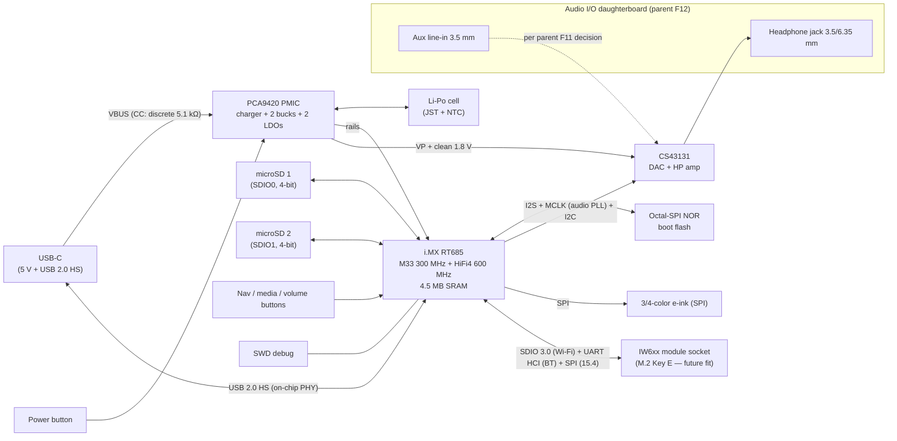

# OSAP EVT-1 — Engineering Validation Board (i.MX RT600 architecture)

**Board design document (rev 0.2, 2026-07-17) — parent: [DESIGN.md](DESIGN.md)**

> Full-product engineering validation board built around the **NXP i.MX RT685**
> (Cortex-M33 + HiFi4 audio DSP) and the **Cirrus Logic CS43131**, with an on-board
> **expansion socket for a future NXP IW6xx-series tri-radio wireless module**
> (Wi-Fi 6 + dual-mode Bluetooth 5.4 + 802.15.4). This is the **first custom board
> of the OSAP v1 architecture** (DESIGN.md §3), validating the full product feature
> set. Licensing follows the parent: CERN-OHL-S-2.0 (hardware),
> GPL-3.0-or-later (firmware), CC-BY-SA-4.0 (docs).

---

## 1. Why this architecture

- **Native storage:** two SD/eMMC/SDIO host controllers — 4-bit SD at full card
  speeds, so USB HS file transfer is card-bound, not interface-bound
- **Universal wireless audio:** the IW6xx module is dual-mode BT (BR/EDR + LE 5.4);
  Classic **A2DP source** works with virtually every BT headphone, and Zephyr
  carries an in-tree A2DP source sample (NXP-contributed Classic host)
- **Audio-first silicon:** HiFi4 DSP (600 MHz) can offload decode/SRC/EQ while the
  M33 (300 MHz) runs UI/system; audio PLL with a dedicated MCLK output for the CS43131
- **USB 2.0 HS with on-chip PHY** — fast transfers into two cards' worth of library
- **Mature parts:** RT600 family shipping since ~2020, in-tree Zephyr board support,
  broad availability

**Trade-offs accepted:** Bluetooth is not integrated in the MCU — wireless audio
arrives via the socketed module, and the device ships/boots without it; the two-chip
radio adds cost/area when fitted; the HiFi4 DSP toolchain (Cadence Xtensa) is
proprietary — see §7 firmware policy and parent R12.

## 2. Objectives & exit criteria

| # | Objective | Exit criterion |
|---|---|---|
| E1 | Full local audio path on final architecture: 2× SD → decode → I2S → CS43131 → audio I/O daughterboard | 24/96 FLAC gapless, glitch-free 1 h; both cards mounted simultaneously |
| E2 | Native SD throughput | Sustained read ≥ **10 MB/s** per slot (4-bit SD, HS timing); benchmark published to parent R1 |
| E3 | USB 2.0 HS mass-storage/MTP transfer rate | ≥ **8 MB/s** host-visible on a UHS-I card (SD-bound, not USB-bound) |
| E4 | E-ink UI + full control set (nav/power/media/volume) usable for browse + playback | Screen map v1 navigable; partial-refresh browsing < **TBD** ms/page |
| E5 | Power/battery: measured per-state draw vs parent §4.3 budget; battery life projection | ≥ **TBD** h local playback projected from measurements; ship-mode ≤ **TBD** µA |
| E6 | Radio socket electrically validated with an IW6xx module/DVK fitted | Module enumerates: SDIO (Wi-Fi) + UART HCI (BT) both alive |
| E7 | **Bluetooth Classic A2DP source** to ordinary headphones via Zephyr Classic host (module fitted) | SBC stream to a consumer BT headphone ≥ 30 min |
| E8 | Audio quality vs CS43131 32 Ω datasheet figures (125 dB DR, −110 dB THD+N) | Meets §8 instrumentation sanity bounds; AP-class verification at this stage if instrument access secured |
| E9 | Aux line-in path per parent F11 decision (pass-through and/or ADC) | Selected mode(s) functional end-to-end |

## 3. Scope

**In scope (full product feature set):** RT685 + octal-SPI boot flash, CS43131 on the
**audio I/O daughterboard interconnect** (parent F12: headphone out + aux in),
**2× microSD on native SD hosts**, USB-C (charge + USB 2.0 HS), PMIC + Li-Po battery,
3/4-color e-ink display, full button set, **IW6xx module socket (unpopulated by
default)**, SWD debug.

**Out of scope:** enclosure (DVT), Wi-Fi *features* (socket is validated, Wi-Fi
functionality deferred), LE Audio (revisit once NXP/Zephyr support on IW6xx matures),
DSP-accelerated effects beyond basic decode offload.

## 4. Block diagram

## 5. Key components

### 5.1 NXP i.MX RT685 (MIMXRT685S, package TBD)

| Item | Value (verify against datasheet before schematic freeze) |
|---|---|
| Cores | Cortex-M33 @ 300 MHz (+128 KB TCM) + Cadence **HiFi4 audio DSP @ 600 MHz** |
| Memory | **4.5 MB on-chip SRAM** (shared M33/DSP); no internal flash → external octal/quad-SPI NOR (XIP) |
| Storage I/F | **2× SD/eMMC/SDIO host controllers** (SDIO0/SDIO1) — one per microSD slot |
| USB | USB 2.0 **high-speed** device/host with **on-chip PHY** |
| Audio | Multiple I2S via Flexcomm, DMIC subsystem, **audio PLL with MCLK output pin** — [ ] verify fractional PLL hits both 22.5792 and 24.576 MHz families and jitter vs CS43131 direct-MCLK mask (else CS43131 PLL-ref mode; parent R7) |
| I/O voltage | [ ] Verify VDDIO domain ranges/count — SD at native 3.3 V expected (no level shifters), confirm per-domain assignment for SD/e-ink/radio socket |
| Power | Audio-crossover part with deep low-power modes — [ ] map power modes to playback/idle/sleep states; [ ] confirm PMIC pairing (§6.4) |
| Software | Zephyr in-tree (`mimxrt685_evk`, plus an audio-focused `mimxrt685_aud_evk` variant); MCUXpresso SDK (BSD-3-Clause) |
| Notes | Mature part (shipping since ~2020). [ ] Check errata + long-term availability; [ ] evaluate newer i.MX RT700 as drop-in-era alternative (more SRAM, lower power) before schematic freeze |

### 5.2 Cirrus Logic CS43131 — verified constraints (2026-07 design review)

Key constraints, verified against the datasheet (DS1155F2): **true MCLK required** (no
SCLK-derived mode); **I2C-only control** (ADR strap); supplies VA/VCP/VL/VD at
1.66–1.94 V plus **VP at 3.0–5.25 V, sequenced up-first/down-last**; HP_DETECT is
VP-referenced; use the **32 Ω figures** (125 dB DR, −110 dB THD+N, 30.8 mW) as
targets. The RT685's audio-PLL MCLK output is the intended clock source (§5.1 verify).

### 5.3 IW6xx radio module socket (future fit)

| Item | Value |
|---|---|
| Target silicon | NXP **IW612** (2.4/5 GHz 1×1 Wi-Fi 6 + **dual-mode Bluetooth 5.4** (BR/EDR + LE) + 802.15.4); IW610/IW611 siblings acceptable — [ ] confirm BR/EDR on chosen variant |
| Host interfaces | **SDIO 3.0** (Wi-Fi) + **UART** (BT HCI, flow-controlled) + optional SPI (802.15.4) — dedicated CPUs per subsystem on-module |
| Socket format | **M.2 Key E (recommended)** — accepts off-the-shelf Murata/AzureWave IW61x modules and NXP DVKs; alternative: 2.54 mm dual-row headers carrying the same signal set |
| Signal set | SDIO CLK/CMD/D0–3, UART TX/RX/RTS/CTS, SPI (optional), WL/BT enable lines, host-wake IRQs, **32.768 kHz sleep clock**, 3.3 V + GND — [ ] pin against M.2 Key E standard WLAN/BT mapping |
| Certification | Use a pre-certified module when fitted; socket keeps EVT-1 sellable/testable as a **radio-less** device |
| Firmware note | IW6xx radio firmware is an NXP binary loaded at runtime onto the module's own CPUs — a separate program on separate hardware (GPL-clean aggregation, unlike in-image blobs; parent §7) |

### 5.4 PMIC — NXP PCA9420 (decided 2026-07-17)

Chosen for its RT600-native pairing: it is the PMIC on
NXP's own RT685 EVK, its Zephyr regulator driver is in-tree (`nxp,pca9420`), and its
hardware **mode-select pins let the MCU switch pre-programmed rail groups in step
with RT600 power states** — the low-power story the parent doc's battery-life
priority wants.

| Item | Value (verify against datasheet) |
|---|---|
| Charger | Linear Li-ion charger, **up to 315 mA** (I2C-programmable CC/CV) — slow-charge trade-off, see risk V3 |
| Rails | 2× buck (I2C-programmable, PFM light-load efficiency) + 2× LDO |
| Modes | Ship mode; ON-pin power button; **mode-select pins** for host-driven rail-group switching ([ ] map to RT600 sleep states) |
| Host I/F | I2C Fm+ (1 Mbit/s) |
| USB-C | **No CC detection** — discrete 5.1 kΩ CC pull-downs (UFP) return to the USB-C block; input current limit set via I2C ([ ] optional CC-voltage ADC sense to detect a 1.5 A source) |
| Fuel gauge | **None on-chip** — RT685 ADC battery-voltage sensing + an open-source SoC estimate: fuel gauging with **no vendor binary in the firmware image** |
| Package | 24-QFN 3×3 mm (WLCSP option) |
| Notes | [ ] Evaluate sibling **PCA9421** (higher-current variant) if the charge-time case fails; [ ] confirm a VSYS-class power-path node exists for the CS43131 VP rail |

## 6. Circuit blocks (schematic checklist)

- **Power (PCA9420-centered) — rail sketch, verify all:**
  - SW1 buck → RT685 VDDCORE ([ ] voltage/current per RM, DVS via mode registers)
  - SW2 buck → **3.3 V system** (SD ×2, e-ink, level-shifted misc)
  - LDO2 → 1.8 V digital/VDDIO domain; LDO1 → always-on standby domain ([ ] needed?)
  - CS43131 clean 1.8 V (VA/VCP/VL/VD): **TPS7A20-class low-noise LDO fed from SW2
    3.3 V**; **VP from the power-path/battery node** ([ ] confirm PCA9420 SYS node;
    HV_EN=0 below 3.3 V per §5.2); **VP up first, down last** via
    enable-sequence/mode config
  - **Radio socket 3.3 V: dedicated external buck** ([ ] IW612 Wi-Fi TX bursts —
    likely > 400 mA — must not share the SW2 budget); switchable off when unfitted
  - Battery-voltage divider → RT685 ADC (open-source gauge, §5.4); mode-select pins
    wired MCU → PMIC for sleep-state rail switching
  - Star ground / analog moat per CS43131 layout guide
- **Boot flash:** octal-SPI NOR ([ ] size TBD ≥ 16 MB; XIP + OTA slots per §7 DFU)
- **USB-C:** discrete 5.1 kΩ CC pull-downs (PCA9420 has no CC PHY); [ ] optional CC
  sense divider → RT685 ADC to raise the PMIC input-current limit on 1.5 A+ sources;
  ESD; HS pair to on-chip PHY
- **microSD ×2:** native 4-bit on SDIO0/SDIO1 at 3.3 V ([ ] UHS-I 1.8 V switch — worth
  it only if card power/perf case closes; card-detect; per-slot power switches for
  hot-swap and sleep)
- **Audio I/O daughterboard interconnect:** per parent §4.2 — headphone L/R + ground,
  aux L/R in + ground, jack detects, shield ([ ] FPC vs mezzanine decision lands here)
- **E-ink:** SPI + control GPIO at panel voltage ([ ] confirm RT685 VDDIO domain
  covers 3.3 V panels natively)
- **Radio socket:** M.2 Key E mechanicals, SDIO length-matching, UART flow control,
  32.768 kHz from PMIC/RTC ([ ] source), antenna keep-out per module vendor
- **Buttons/debug:** full parent F9 set; wake wiring through PMIC; SWD header; UART
  test pads
- **PCB:** 4-layer minimum (charger thermals, analog moat,
  USB HS routing; SDIO buses add length-matching)

## 7. Firmware & software stack

- **Zephyr on the M33** — start from in-tree `mimxrt685_evk`/`mimxrt685_aud_evk`,
  fork to `osap_evt1` board. Parent §5 stack carries over: LVGL e-ink UI, FatFs
  (now on native `sdhc` 4-bit driver — retire `sdhc_spi`), USB `usbd` MSC/MTP,
  settings, input, PM. **PCA9420 regulator driver is in-tree** (`nxp,pca9420`) and
  already exercised by the EVK board files — direct reuse; battery gauge is a small
  open ADC-based module we write (no vendor blob)
- **DSP policy (licensing-aware):** all *mandatory* features run on the M33 with
  open toolchains; HiFi4 offload (decode/SRC/EQ) is an *optional* build using the
  proprietary Xtensa toolchain — keeps the shipped baseline 100 % buildable with
  free tools ([ ] confirm GPL §3 "system library"/toolchain posture in parent §7
  review; DSP firmware would itself be GPL-licensed source, only the compiler is
  proprietary)
- **Bluetooth (module fitted):** Zephyr Bluetooth **Classic host (experimental,
  NXP-driven)** over UART HCI — in-tree **A2DP source** + AVRCP samples as starting
  points; SBC codec mandatory ([ ] evaluate maturity against E7 early — this is the
  newest software in the plan); LE via the same HCI when needed
- **DFU:** MCUboot on octal-SPI flash (the standard RT600 path); SMP over USB;
  SD-card fallback
- **Wi-Fi (future):** NXP `nxp_wifi` Zephyr driver over SDIO — explicitly out of
  EVT-1 firmware scope beyond socket validation (E6)

## 8. Test & measurement plan

- SD: per-slot + simultaneous dual-card sequential/random benchmarks (E2); USB MSC/MTP
  host-side transfer timing (E3)
- Audio: sanity bounds on a bench audio interface (a typical USB interface cannot
  resolve datasheet-grade figures — treat as bounds only); AP-class session for E8
  if available; battery-vs-USB noise floor
- BT (module fitted): A2DP to ≥ 3 consumer headphones (SBC), range walk, coexistence
  with e-ink refresh bursts (E7)
- Power: per-state rail currents (PPK2 on battery rail), battery-life projection
  model (E5); radio-socket load step test with module TX bursts
- UI: e-ink partial-refresh latency and ghosting across the browse flow (E4)

## 9. Risks & open questions

| # | Item | Next step |
|---|---|---|
| V1 | Zephyr Classic host/A2DP is experimental — depth of qualification unknown | Prototype E7 early on RT685-EVK + IW612 DVK **before** EVT-1 layout; fallback: NXP EtherMind stack (MCUXpresso, license review needed) |
| V2 | RT685 VDDIO domains / power-mode map unverified against our rail plan | Datasheet + reference-manual review before schematic; EVK schematics as reference |
| V3 | PCA9420 charger caps at **315 mA** — a 1500–2000 mAh cell charges in ~6–8 h | Decide if acceptable for the product; evaluate PCA9421 sibling or a parallel charge path; note charge-while-playing shares the same input |
| V4 | Audio PLL exact-rate/jitter for CS43131 direct-MCLK mode | Verify in RM; fallback CS43131 PLL-ref mode (relaxed phase-noise mask) |
| V5 | i.MX RT700 supersedes RT600 mid-project | Availability/longevity check on both before freeze |
| V6 | M.2 Key E pinout vs NXP module DVK pinouts may diverge (vendor-specific straps) | Pin the socket against a specific module p/n (Murata IW612 module) early |
| V7 | ~~Parent F5 wording change~~ | **Resolved 2026-07-17:** architecture adopted project-wide; parent DESIGN.md updated |
| V8 | Wi-Fi capability invites scope creep (streaming, sync) | Explicitly deferred; revisit at DVT with product hat on |

## 10. BOM sketch (majors only)

| Ref | Part | Role |
|---|---|---|
| U1 | NXP MIMXRT685S | M33 + HiFi4 application processor |
| U2 | Cirrus CS43131 | DAC + headphone amp (daughterboard-fed) |
| U3 | Octal-SPI NOR flash (**TBD**, ≥ 16 MB) | XIP boot + OTA slots |
| U4 | NXP **PCA9420** | Charger, power path, bucks/LDOs, mode-switched rails |
| U7 | 3.3 V buck for radio socket (**TBD**) | IW6xx module supply (fit with module) |
| U5 | Low-noise LDO (TPS7A20-class) | CS43131 clean 1.8 V |
| J1 | USB-C receptacle | Charge + USB 2.0 HS |
| J2 | M.2 Key E socket | Future IW6xx wireless module |
| J3, J4 | microSD sockets ×2 | SDIO0/SDIO1, 4-bit |
| J5 | Daughterboard interconnect (FPC/mezzanine **TBD**) | Audio I/O per parent F12 |
| J6 | JST-PH battery + 10 kΩ NTC | Li-Po cell |
| DS1 | 3/4-color e-ink panel (**TBD** per parent §4.6) | Display |
| S1–S9 | Buttons | Parent F9 control set |

## 11. References

- i.MX RT600 family / MIMXRT685-EVK: <https://www.nxp.com/design/design-center/development-boards-and-designs/i-mx-evaluation-and-development-boards/i-mx-rt600-evaluation-kit:MIMXRT685-EVK>
- Zephyr `mimxrt685_evk` board docs: <https://docs.zephyrproject.org/latest/boards/nxp/mimxrt685_evk/doc/index.html>
- NXP IW612 tri-radio: <https://www.nxp.com/products/IW612> (datasheet: <https://www.nxp.com/docs/en/data-sheet/IW612.pdf>)
- Zephyr Bluetooth Classic A2DP source sample: <https://docs.zephyrproject.org/latest/samples/bluetooth/classic/a2dp_source/README.html>
- NXP PCA9420 PMIC: <https://www.nxp.com/products/PCA9420-PCA9421> (datasheet: <https://www.nxp.com/docs/en/data-sheet/PCA9420.pdf>; Zephyr binding: `nxp,pca9420`)
- Cirrus CS43131 datasheet (DS1155F2): <https://statics.cirrus.com/pubs/proDatasheet/CS43131_DS1155F2.pdf>
- Parent: [DESIGN.md](DESIGN.md)
