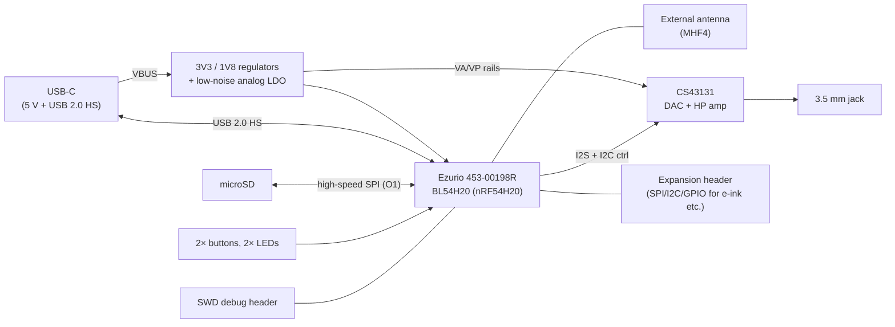

# OSAP PoC-1 — First Proof-of-Concept Board

**Spin-off design document (rev 0.1, 2026-07-16) — parent: [DESIGN.md](DESIGN.md)**

> Purpose-built bring-up board pairing the **Ezurio 453-00198R** (BL54H20 module,
> Nordic nRF54H20 inside) with the **Cirrus Logic CS43131** DAC/headphone amp.
> Goal: retire the parent document's highest-priority risks before committing to
> the EVT board (DESIGN.md §10 M3). Licensing follows the parent: CERN-OHL-S-2.0
> (hardware), GPL-3.0-or-later (firmware), CC-BY-SA-4.0 (docs).

---

## 1. Objectives & exit criteria

PoC-1 exists to answer questions, not to be a product. Each objective maps to a
parent-document risk:

| # | Objective | Parent risk | Exit criterion |
|---|---|---|---|
| O1 | Measure microSD throughput on the H20 (high-speed SPI; module lists **no SDMMC/SDIO**) | R1 | Sustained read ≥ **TBD** MB/s (set by max codec bitrate + indexing UX) |
| O2 | Local playback: SD → decode → I2S → CS43131 → headphones, glitch-free | — | 24-bit/96 kHz FLAC plays clean for 1 h |
| O3 | LE Audio unicast stream to a headset from the module | R2, R7 | Stable LC3 stream ≥ 30 min; CPU headroom measured |
| O4 | Simultaneous decode + LC3 encode + UI-idle CPU load profile | R7 | ≤ **TBD** % app-core utilization |
| O5 | Power profile per state (idle, local playback, BT streaming) | R6, §4.3 budget | Numbers feed DESIGN.md power budget table |
| O6 | Audio quality sanity: noise floor, THD+N vs CS43131 datasheet | §2.2 targets | Within **TBD** dB of datasheet figures |
| O7 | Validate SUIT DFU flow on module hardware | R9 | Successful signed update via USB or SD fallback |

## 2. Scope

**In scope:** Ezurio module, CS43131 + 3.5 mm jack, 1× microSD, USB-C (power + HS data),
minimal buttons/LEDs, SWD debug, expansion headers.

**Out of scope (deferred to EVT):** battery/PMIC (USB-powered only), e-ink display
(use an off-the-shelf SPI module on the expansion header if desired), second microSD,
audio I/O daughterboard (PoC mounts the jack directly), aux input, enclosure.

## 3. Block diagram

## 4. Key components

### 4.1 Ezurio 453-00198R (BL54H20 module)

| Item | Value |
|---|---|
| SoC | Nordic nRF54H20 (dual M33 320/256 MHz + RISC-V PPR/FLPR) |
| Radio | Bluetooth 5.4 single-mode LE, 802.15.4, NFC-A tag; 2402–2480 MHz |
| Antenna | **MHF4 connector** (this variant) — external antenna required on PoC-1 |
| Interfaces (per Ezurio) | USB, CAN FD, NFC-A, I3C, UART, QSPI, SPI, **high-speed SPI**, I2S, I2C, PDM, PWM, ADC, GPIO, QDEC — **no SDMMC/SDIO listed** (→ O1) |
| Software | nRF Connect SDK / Zephyr |
| Notes | [ ] Verify module datasheet: pin-out, GPIO count, USB HS routed to pads, supply rails, RF certifications (module showed zero distributor stock at time of writing — confirm availability/lead time) |
| Alternate | 453-00197R sibling variant (integrated antenna? **TBD** — verify; could simplify PoC) |

### 4.2 Cirrus Logic CS43131

| Item | Value (verify all against datasheet before schematic freeze) |
|---|---|
| Function | 32-bit/384 kHz "MasterHIFI" DAC with integrated ground-centered headphone amplifier |
| Performance | ~130 dB DR, ~−115 dB THD+N (datasheet conditions) |
| Formats | PCM up to 32-bit/384 kHz; DSD64/128 |
| Output | Ground-referenced (negative charge pump — no output caps); drives 16–600 Ω |
| Control / audio | I2C (or SPI) control + I2S serial audio |
| Extras | [ ] Verify: internal PLL / clocking options (single-reference design?), headphone impedance detection, volume ramp/pop suppression |
| Supplies | [ ] Confirm rail set (VA/VP/VL/VD voltages + sequencing) from datasheet |

## 5. Circuit blocks (schematic checklist)

- **Power:** USB VBUS → 3V3 buck or LDO (module) + separate **low-noise LDO** for
  CS43131 analog rails; star ground / analog moat per CS43131 layout guide
  - [ ] Current budget incl. HP amp charge pump; inrush on USB spec-compliant
- **USB-C:** 5.1 kΩ CC pull-downs (UFP), ESD array, HS differential pair to module
  - [ ] Verify module pins expose the H20's HS PHY signals
- **CS43131:** decoupling + charge-pump caps per datasheet, I2S (MCLK? → clocking
  decision from §4.2 verify), I2C address straps, RESET GPIO, jack with detect switch
- **microSD:** high-speed SPI wiring, card-detect, series terminations; test points on
  CLK/CMD for scope work (O1)
- **Debug/UI:** 10-pin SWD header, UART test pads, 2 buttons (play/pause, next),
  2 LEDs (status, BT), expansion header with SPI + I2C + 4 GPIO + rails
- **Antenna:** MHF4 pigtail to certified antenna — [ ] pick antenna p/n from Ezurio's
  certified list to preserve module certification
- **PCB:** 2- or 4-layer **TBD** (4-layer strongly preferred for the analog section);
  no size constraint — favor probeability over density

## 6. Firmware bring-up plan (Zephyr board `osap_poc1`)

1. Board definition + blink/shell over RTT (sanity)
2. USB device enumeration (HS) — CDC shell
3. microSD mount + **throughput benchmark** (O1) — publish numbers to DESIGN.md
4. I2C comms with CS43131; sine playback via I2S (O2 start)
5. FatFs + FLAC decode → full local-playback chain (O2)
6. LE Audio unicast source to headset (O3), then combined-load profiling (O4)
7. Power measurements per state on instrumented rail (O5)
8. SUIT DFU exercise (O7)

## 7. Test & measurement plan

- SD: `dd`-style sequential + random read benchmarks at several SPI clocks
- Audio: loopback into an audio interface / analyzer — noise floor, THD+N, channel
  balance at 1 kHz 0 dBFS (O6); listening test with IEMs for hiss
- BT: RSSI/range walk test, stream robustness with interference (2.4 GHz busy env)
- Power: per-state current via inline monitor (PPK2 or equivalent)
- Results recorded in `poc1/results/` — **TBD** structure

## 8. PoC-specific risks / open questions

| # | Item | Next step |
|---|---|---|
| P1 | Module availability (zero stock observed) | Contact Ezurio/distys; check 453-0019xR siblings |
| P2 | Does the module expose USB HS pins? | Module datasheet review before schematic |
| P3 | CS43131 clocking without dedicated audio crystal | Datasheet PLL section; add footprint for optional crystal as fallback |
| P4 | High-speed SPI max clock to SD in Zephyr driver | Check `sdhc_spi` driver limits early |
| P5 | LE Audio headset for testing | Acquire known-good LC3 unicast sink (e.g., recent earbuds with LE Audio) |

## 9. BOM sketch (majors only)

| Ref | Part | Role |
|---|---|---|
| U1 | Ezurio 453-00198R | BL54H20 radio/compute module |
| U2 | Cirrus CS43131 | DAC + headphone amp |
| U3 | Low-noise LDO (**TBD**, e.g., TPS7A20-class) | Analog rail |
| U4 | 3V3 regulator (**TBD**) | Digital rail |
| J1 | USB-C receptacle | Power + USB 2.0 HS |
| J2 | 3.5 mm jack w/ detect | Headphone out |
| J3 | microSD socket, push-push | Storage |
| J4 | MHF4 → antenna (**TBD** from certified list) | RF |
| J5 | 10-pin 1.27 mm header | SWD |

## 10. References

- Ezurio 453-00198R product page: <https://www.ezurio.com/part/453-00198r>
- 453-00198R product brief (Mouser): <https://www.mouser.com/catalog/specsheets/EZURIO_12-09-2024_453-00198R-brief.pdf>
- Cirrus Logic CS43131 datasheet — TBD link
- Parent design document: [DESIGN.md](DESIGN.md)
