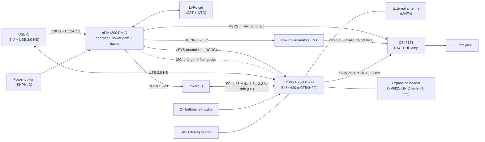

# OSAP PoC-1 — First Proof-of-Concept Board

**Spin-off design document (rev 0.1, 2026-07-16) — parent: [DESIGN.md](DESIGN.md)**

> Purpose-built bring-up board pairing the **Ezurio 453-00198R** (BL54H20 module,
> Nordic nRF54H20 inside) with the **Cirrus Logic CS43131** DAC/headphone amp.
> Goal: retire the parent document's highest-priority risks before committing to
> the EVT board (DESIGN.md §10 M3). Licensing follows the parent: CERN-OHL-S-2.0
> (hardware), GPL-3.0-or-later (firmware), CC-BY-SA-4.0 (docs).

---

## 1. Objectives & exit criteria

PoC-1 exists to answer questions, not to be a product. Each objective maps to a
parent-document risk:

| # | Objective | Parent risk | Exit criterion |
|---|---|---|---|
| O1 | Measure microSD throughput on the H20 (SPI only — no SDMMC/SDIO; 3.3 V signaling constrained by 1.8 V-dominant I/O, see §4.1) | R1 | Sustained read ≥ **1.2 MB/s** (covers 24/96 FLAC + indexing; SPI-mode wire ceiling is ~2–3 MB/s) |
| O2 | Local playback: SD → decode → I2S → CS43131 → headphones, glitch-free | — | 24-bit/96 kHz FLAC plays clean for 1 h |
| O3 | LE Audio unicast stream to a headset from the module — **exploratory**: NCS audio apps support only nRF5340 today (→ P8) | R2, R7, R11 | CIS established + LC3 stream runs; CPU headroom measured. *Stretch:* 30 min glitch-free |
| O4 | Simultaneous decode + LC3 encode + UI-idle CPU load profile | R7 | ≤ **TBD** % app-core utilization |
| O5 | Power profile per state (idle, local playback, BT streaming) | R6, §4.3 budget | Numbers feed DESIGN.md power budget table |
| O6 | Audio quality sanity: noise floor, THD+N vs CS43131 datasheet (32 Ω figures: 125 dB DR, −110 dB THD+N) | §2.2 targets | Sanity bounds on available instrumentation (e.g., ≥ 110 dB DR, ≤ −95 dB THD+N into 32 Ω); battery-vs-USB noise floor compared (P7). Datasheet-grade verification needs AP-class gear (§7) |
| O7 | Validate **MCUboot + IronSide SE** DFU flow (NCS ≥ 3.1 — SUIT was removed from NCS in 3.1) | R9 | Signed update applied via SMP-over-USB or SD-card fallback |
| O8 | Validate **nPM1300** power subsystem: USB-C CC detection, charge cycle, power path, ship mode, fuel gauge | §4.3 candidate confirmation | CC detect at 500 mA/1.5 A; full JEITA charge cycle; ship-mode draw ≤ **TBD** µA; fuel-gauge SoC within **TBD** % of coulomb-counter reference |

## 2. Scope

**In scope:** Ezurio module, CS43131 + 3.5 mm jack, **nPM1300 PMIC + Li-Po battery
connector** (board runs from USB or battery), power button (ship-mode wake), 1× microSD,
USB-C (power + HS data), minimal buttons/LEDs, SWD debug, expansion headers.

**Out of scope (deferred to EVT):** e-ink display (off-the-shelf SPI modules are
3.3 V-logic — expansion header is 1.8 V, so budget a level-shifter breakout if used),
second microSD, audio I/O daughterboard (PoC mounts the jack directly), aux input,
enclosure.

## 3. Block diagram

## 4. Key components

### 4.1 Ezurio 453-00198R (BL54H20 module)

| Item | Value |
|---|---|
| SoC | Nordic nRF54H20 (dual M33 320/256 MHz + RISC-V PPR/FLPR) |
| Radio | Bluetooth 5.4 single-mode LE, 802.15.4, NFC-A tag; 2402–2480 MHz |
| Antenna | **MHF4 connector** (this variant) — external antenna required on PoC-1 |
| Interfaces (per Ezurio) | USB, CAN FD, NFC-A, I3C, UART, QSPI, SPI, **high-speed SPI**, I2S, I2C, PDM, PWM, ADC, GPIO, QDEC — **no SDMMC/SDIO listed** (→ O1) |
| Software | nRF Connect SDK / Zephyr (upstream nRF54H20 support still labeled *experimental*) |
| I/O voltage | VDDIO_P1/P2/P6/P7: **1.62–1.98 V only**; the sole 3.3 V-capable port is **P9 (6 GPIOs, ≤ 16 MHz)**; the fast 200/100 MHz pads are all 1.8 V — drives the SD level-shift decision (O1) |
| USB / power | USB HS D+/D− exposed (module pads); VBUS pin needs external 10 µF; VDD_HV accepts 1.9–5.5 V via internal DCDC (→ powered from VSYS); sequencing: VDDH/VDD before VDDIO_Px |
| RF / cert | Certified to **+7 dBm conducted** (chip does +10 dBm), only with antennas from Ezurio's approved list (≤ 2.32 dBi) — off-list MHF4 antennas void the modular cert |
| Maturity | Datasheet v1.0 has **TBD radio peak currents**, **TBD HFXO load caps**, and copy-paste errors (LFXO section references nRF54L15); zero distributor stock observed — get datasheet-revision + stock commitments from Ezurio before schematic capture (→ P1) |
| Alternate | **453-00197R** = integrated Ignion chip-antenna variant — recommended for PoC-1 (removes the antenna-selection cert variable) |

### 4.2 Cirrus Logic CS43131

| Item | Value (verify all against datasheet before schematic freeze) |
|---|---|
| Function | 32-bit/384 kHz "MasterHIFI" DAC with integrated ground-centered headphone amplifier |
| Performance | 130 dB DR / −115 dB THD+N into 600 Ω/10 kΩ; **into 32 Ω: 125 dB(A) DR, −110 dB THD+N, 30.8 mW** (Table 3-5) — use the 32 Ω figures for O6 |
| Formats | PCM up to 32-bit/384 kHz; DSD64/128 |
| Output | Ground-referenced (negative charge pump — no output caps); drives 16–600 Ω |
| Control / audio | **I2C only** (≤ 1 MHz, ADR pin strap — no SPI option) + I2S/TDM serial audio; INT pin open-drain, pull to VL |
| Clocking | **True MCLK required** at XTI/MCLK — no SCLK-derived mode. Options: crystal, external 22.5792/24.576 MHz (phase-noise mask applies), or PLL-reference mode (12/13/19.2/24/26 MHz refs, relaxed mask). Baseline: H20 TDM **MCK output from AUDIOPLL** (→ P3) |
| Jack detect | HP_DETECT threshold VIH = 0.93·VP — wire per the datasheet network (swings to VP); **not** a 1.8 V module GPIO |
| Supplies | VA/VCP/VL/VD: **1.66–1.94 V**; **VP: 3.0–5.25 V** (HV_EN=1 requires ≥ 3.3 V); sequencing: **VP up first, down last** |

### 4.3 Nordic nPM1300 PMIC

| Item | Value (verify against datasheet) |
|---|---|
| Charger | 800 mA linear Li-ion/Li-Po charger, JEITA profile via 10 kΩ NTC |
| USB-C | Integrated CC1/CC2 detection — replaces discrete pull-downs. Input current limiter: 100 mA / 500 mA / steps to **1.5 A max** (a 3 A advertisement is detected but unusable; 800 mA charging needs a 1.5 A-capable source, and system load shares the same VBUS limit) |
| Power path | VBUS/battery power path with **ship** and **hibernate** ultra-low-power off modes; SHPHLD pin for power button |
| Rails | 2× buck (~200 mA each, 1.0–3.3 V) + 2× load switch / LDO (~100/50 mA) |
| Extras | 5 GPIO, 3 LED drivers (charge status), I2C host interface |
| Fuel gauge | On-chip V/I/T measurement; Nordic `nrf_fuel_gauge` algorithm runs on the H20 — **licensing caveat**: it ships as a Nordic-5-Clause *binary* library that links into the app image → GPL-incompatible if distributed. Bench use on PoC-1 is fine; EVT needs an open implementation (→ P9, parent §7) |
| Software | Zephyr MFD/regulator/charger/sensor drivers in NCS; **nPM PowerUP** + nPM1300-EK for profiling |
| Notes | [ ] Verify buck current limits against module radio-TX + CS43131 peak budget (→ P6) |

## 5. Circuit blocks (schematic checklist)

- **Power tree (re-partitioned after adversarial review):**
  - Module VDD_HV **directly from VSYS** (1.9–5.5 V accepted, internal DCDC — the
    intended battery topology; frees the bucks); VDDIO_Px at 1.8 V
    ([ ] confirm source: module internal VDD output in high-voltage mode, and its
    current capability)
  - **BUCK1 3V3 → microSD + level shifter only** (SD write transients alone can hit
    100–200 mA; note buck dropout below ~3.4 V VBAT — SD tolerates to 2.7 V)
  - **BUCK2 ~2.4–2.5 V → low-noise LDO → clean 1.8 V** for CS43131 VA/VCP/VL/VD
    (LDO needs dropout headroom — a 1.8 V buck feeding a 1.8 V LDO does not work;
    [ ] check charge-pump peak draw vs LDO rating — iVCP scales toward ~100 mA at
    full 2× 30 mW/32 Ω output)
  - **CS43131 VP from VSYS** (within its 3.0–5.25 V window; [ ] run HV_EN=0 below
    3.3 V VBAT or accept reduced swing); **sequencing: VP up first, down last** via
    nPM1300 startup ordering; module rule VDDH/VDD before VDDIO_Px also honored
  - Battery via JST-PH + 10 kΩ NTC; star ground / analog moat per CS43131 layout guide
  - [ ] Module radio-TX peak currents are **TBD in its own datasheet** — measure on an
    nRF54H20 DK with a PPK2 before schematic freeze (→ P6)
  - [ ] SHPHLD power button wiring (long-press off, wake from ship mode)
  - [ ] Charge-status LED on nPM1300 LED driver; NTC placement near cell
- **USB-C:** CC1/CC2 to nPM1300 (no discrete pull-downs), ESD array, HS differential
  pair to module (D+/D− exposed on module pads; 10 µF on the module VBUS pin)
- **CS43131:** decoupling + charge-pump caps per datasheet; TDM/I2S with **MCK from
  the H20 AUDIOPLL** (baseline — [ ] verify exact 22.5792/24.576 MHz attainability and
  jitter vs the direct-MCLK phase-noise mask; fall back to CS43131 PLL-reference mode,
  which has a relaxed mask); I2C with ADR strap; RESET GPIO; HP_DETECT network per
  datasheet (VP-referenced); INT open-drain to VL; low-capacitance ESD on jack lines
- **microSD:** 3.3 V signaling — **decide before capture:** level shifter from the
  1.8 V fast-SPI pads (shifter becomes the MISO timing bottleneck > ~20 MHz) **vs**
  P9 slow SPIM (≤ 16 MHz; [ ] confirm SPIM routability to P9). SD SPI mode is
  spec-capped at 25 MHz either way. Card-detect, series terminations, test points on
  CLK/CMD (O1)
- **Debug/UI:** 10-pin SWD header, UART test pads, 2 buttons (play/pause, next),
  2 LEDs (status, BT), expansion header with SPI + I2C + 4 GPIO + rails
- **Antenna:** MHF4 pigtail to certified antenna — [ ] pick antenna p/n from Ezurio's
  certified list to preserve module certification
- **PCB:** **4-layer (committed)** — required for charger thermals (worst-case linear
  dissipation ≈ 1.6 W; QFN32 RθJA 24.2 °C/W assumes a JESD51-7 4-layer board — a
  2-layer board would hit thermal regulation and stall the O8 charge cycle), the
  analog moat, and the USB HS pair; no size constraint — favor probeability over density

## 6. Firmware bring-up plan (Zephyr board `osap_poc1`, **NCS ≥ 3.1**)

1. Board definition + **BICR provisioning and lifecycle-state transition via nrfutil**
   (mandatory on every first-boot H20 board: rail/IO-voltage config, oscillator caps)
   + blink/shell over RTT (sanity)
2. nPM1300 bring-up: regulator/charger drivers, charge a cell, read status,
   `nrf_fuel_gauge` sampling, ship-mode entry + button wake (O8)
3. USB device enumeration (HS) — CDC shell
4. microSD mount + **throughput benchmark** (O1) — publish numbers to DESIGN.md
5. I2C comms with CS43131; sine playback via I2S (O2 start)
6. FatFs + FLAC decode → full local-playback chain (O2)
7. LE Audio unicast source to headset (O3), then combined-load profiling (O4)
8. Power measurements per state, battery-powered (O5)
9. MCUboot + IronSide SE DFU exercise, SMP-over-USB (O7)

## 7. Test & measurement plan

- SD: `dd`-style sequential + random read benchmarks at several SPI clocks
- Audio: noise floor, THD+N, channel balance at 1 kHz 0 dBFS (O6); listening test with
  IEMs for hiss. **Instrumentation honesty:** a typical USB audio interface
  (−100…−110 dB THD+N residual) measures itself, not a −110 dB DUT — treat interface
  results as sanity bounds; datasheet-grade verification needs AP-class gear or an
  E1DA Cosmos-grade ADC with the AES17 −60 dBFS method (+ notch for THD+N) — rent or
  borrow at M4 if not sooner
- BT: RSSI/range walk test, stream robustness with interference (2.4 GHz busy env)
- Power: per-state current via inline monitor (PPK2 or equivalent) on the battery rail;
  full charge/discharge curve to calibrate the fuel-gauge battery model (nPM PowerUP)
- Results recorded in `poc1/results/` — **TBD** structure

## 8. PoC-specific risks / open questions

| # | Item | Next step |
|---|---|---|
| P1 | Module availability (zero stock) **and datasheet maturity** (v1.0: TBD peak currents, TBD HFXO caps, copy-paste errors) | Get stock date + datasheet-revision commitment from Ezurio; prefer **453-00197R** (integrated Ignion antenna) for PoC-1 |
| P2 | ~~Does the module expose USB HS pins?~~ **Resolved:** D+/D− on module pads; VBUS pin needs external 10 µF | Wire per module datasheet |
| P3 | CS43131 needs a true MCLK (no SCLK-derived mode) | Baseline: H20 TDM MCK from AUDIOPLL; verify exact rates + phase noise, else PLL-reference mode. Crystal fallback = one sample-rate family per crystal (22.5792 MHz is not a valid PLL ref) |
| P4 | SD SPI throughput through the 1.8→3.3 V domain fix | Check `sdhc_spi` driver limits + level-shifter MISO timing early; P9 SPIM routability |
| P5 | LE Audio headset for testing | Acquire known-good LC3 unicast sink (e.g., recent earbuds with LE Audio) |
| P6 | Power budget can't be computed from vendor data — module datasheet lists radio TX peaks as TBD | Measure module peaks on nRF54H20 DK + PPK2 before schematic freeze (module now on VSYS; BUCK1 dedicated to SD) |
| P7 | Buck switching noise reaching CS43131 analog rails | LDO PSRR selection + layout separation; measure noise floor USB vs battery (O6) |
| P8 | **LE Audio on the H20 is unsupported in NCS audio apps** (nRF5340 only as of July 2026); SDC ISO/CIS enablement on the H20 radio core unverified | Prove the LE Audio chain on an nRF5340 Audio DK in parallel; O3 re-scoped exploratory; ask Nordic/Ezurio for the H20 LE Audio roadmap before EVT commitment |
| P9 | `nrf_fuel_gauge` binary lib (Nordic-5-Clause) is GPL-incompatible for distributed firmware | Bench-only on PoC-1; open-source gauge (V/I/T lookup from nPM1300 ADC) for EVT — tracked in parent §7 |

## 9. BOM sketch (majors only)

| Ref | Part | Role |
|---|---|---|
| U1 | Ezurio 453-00198R | BL54H20 radio/compute module |
| U2 | Cirrus CS43131 | DAC + headphone amp |
| U3 | Low-noise LDO (**TBD**, e.g., TPS7A20-class) | CS43131 analog rail (fed from nPM1300 buck) |
| U4 | Nordic **nPM1300** | PMIC: charger, power path, USB-C CC, bucks, fuel gauge |
| J6 | JST-PH battery connector + 10 kΩ NTC | Li-Po cell |
| S1 | Power button | nPM1300 SHPHLD (ship-mode wake) |
| U6 | 1.8↔3.3 V level shifter (**TBD**, direction-fixed, e.g., TXU-class) | microSD SPI domain crossing (if fast-pad option chosen) |
| J1 | USB-C receptacle | Power + USB 2.0 HS |
| J2 | 3.5 mm jack w/ detect | Headphone out |
| J3 | microSD socket, push-push | Storage |
| J4 | MHF4 → antenna (**TBD** from certified list) | RF |
| J5 | 10-pin 1.27 mm header | SWD |

## 10. References

- Ezurio 453-00198R product page: <https://www.ezurio.com/part/453-00198r>
- 453-00198R product brief (Mouser): <https://www.mouser.com/catalog/specsheets/EZURIO_12-09-2024_453-00198R-brief.pdf>
- BL54H20 datasheet v1.0: <https://connectivity-staging.s3.us-east-2.amazonaws.com/2024-12/EZ-DS-BL54H20_v1_0.pdf>
- Cirrus Logic CS43131 datasheet (DS1155F2): <https://statics.cirrus.com/pubs/proDatasheet/CS43131_DS1155F2.pdf>
- Nordic nPM1300: <https://www.nordicsemi.com/Products/nPM1300> (+ nPM1300-EK, nPM PowerUP)
- NCS 3.1 migration: SUIT removed, IronSide SE + MCUboot on nRF54H20:
  <https://docs.nordicsemi.com/bundle/ncs-latest/page/nrf/releases_and_maturity/migration/migration_3.1_54h_suit_ironside.html>
- Parent design document: [DESIGN.md](DESIGN.md)
